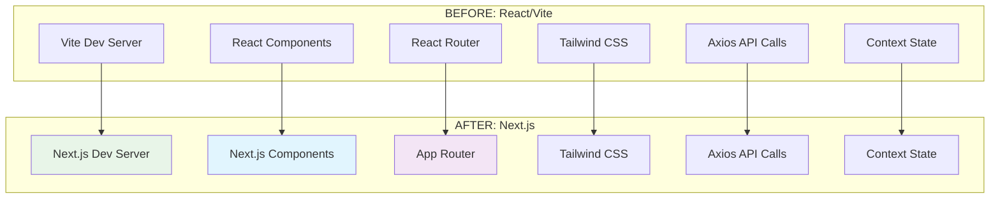

# Design Document: Next.js Migration

## Overview

This design document outlines the technical approach for migrating the HerbalSource e-commerce application from React/Vite to Next.js 14+ while maintaining **100% identical functionality, layout, and user experience**. The migration focuses on framework conversion without any visual or functional modifications.

## Architecture

### Migration Architecture Comparison



### File Structure Migration

**Current React/Vite Structure:**
```
src/
├── components/
├── pages/
├── contexts/
├── utils/
├── data/
└── main.jsx
```

**New Next.js Structure:**
```
app/
├── (routes)/
│   ├── page.tsx
│   ├── products/
│   ├── admin/
│   └── layout.tsx
├── components/
├── contexts/
├── utils/
└── data/
```

## Components and Interfaces

### Component Migration Strategy

**1. Page Components → App Router Pages**
- `src/pages/HomePage.jsx` → `app/page.tsx`
- `src/pages/ProductsPage.jsx` → `app/products/page.tsx`
- `src/pages/ProductPage.jsx` → `app/product/[slug]/page.tsx`
- `src/pages/admin/` → `app/admin/`

**2. Component Preservation**
- All components in `src/components/` move to `app/components/`
- Zero changes to component logic or styling
- Preserve all props, state, and functionality

**3. Context Migration**
- `src/contexts/CartContext.jsx` → `app/contexts/CartContext.tsx`
- Identical context logic and providers
- Same state management patterns

### Routing Migration

**React Router → App Router Mapping:**

| React Router | Next.js App Router |
|-------------|-------------------|
| `/` | `app/page.tsx` |
| `/products` | `app/products/page.tsx` |
| `/product/:slug` | `app/product/[slug]/page.tsx` |
| `/cart` | `app/cart/page.tsx` |
| `/checkout` | `app/checkout/page.tsx` |
| `/admin/*` | `app/admin/*/page.tsx` |
| `/login` | `app/login/page.tsx` |

**Navigation Component Updates:**
- Replace `react-router-dom` `Link` with Next.js `Link`
- Preserve all navigation logic and styling
- Maintain identical user experience

## Data Models

### API Integration Preservation

**Current API Configuration (Preserved):**
```javascript
// app/utils/api.js - IDENTICAL to current
const API_BASE_URL = process.env.NEXT_PUBLIC_API_URL || 'http://localhost:5000/api';

export const api = {
  // All existing API methods preserved exactly
  getProducts: async () => { /* identical */ },
  createOrder: async (orderData) => { /* identical */ },
  // ... all other methods unchanged
};
```

**Environment Variables Migration:**
```bash
# .env.local (Next.js format)
NEXT_PUBLIC_API_URL=http://localhost:5000/api

# For production:
NEXT_PUBLIC_API_URL=https://herbalsource-backend.onrender.com/api
```

### State Management Preservation

**CartContext Migration (Identical Logic):**
```typescript
// app/contexts/CartContext.tsx
'use client';

// Exact same reducer logic
const cartReducer = (state, action) => {
  // IDENTICAL to current implementation
};

// Exact same provider logic
export const CartProvider = ({ children }) => {
  // IDENTICAL to current implementation
};
```

## Correctness Properties

*A property is a characteristic or behavior that should hold true across all valid executions of a system-essentially, a formal statement about what the system should do. Properties serve as the bridge between human-readable specifications and machine-verifiable correctness guarantees.*

### Property 1: Visual Identity Preservation
*For any* page or component, the rendered output should be pixel-perfect identical to the React/Vite version
**Validates: Requirements 1.2, 6.1, 6.2**

### Property 2: Routing Behavior Preservation
*For any* route navigation, the behavior should be identical to the React Router implementation
**Validates: Requirements 2.1, 2.2, 2.3, 2.4, 2.5**

### Property 3: Component Functionality Preservation
*For any* user interaction with components, the behavior should be identical to the original implementation
**Validates: Requirements 3.1, 3.2, 3.3, 3.4, 3.5**

### Property 4: State Management Identity
*For any* state operation (cart add/remove/update), the behavior should be identical to the original CartContext
**Validates: Requirements 4.1, 4.2, 4.3, 4.4, 4.5**

### Property 5: API Integration Preservation
*For any* API call, the request format and response handling should be identical to the original implementation
**Validates: Requirements 5.1, 5.2, 5.3, 5.4, 5.5**

### Property 6: Styling Consistency
*For any* styled element, the CSS classes and visual appearance should be identical to the original
**Validates: Requirements 6.3, 6.4, 6.5**

### Property 7: Feature Completeness
*For any* existing feature (e-commerce, admin, auth), the functionality should be preserved exactly
**Validates: Requirements 10.1, 10.2, 10.3, 10.4, 10.5**

## Error Handling

### Migration Error Prevention
- **Component Compatibility**: Ensure all React patterns work in Next.js
- **Client-Side Rendering**: Use `'use client'` directive for interactive components
- **Environment Variables**: Prefix with `NEXT_PUBLIC_` for client-side access
- **Import Paths**: Update relative imports for new file structure

### Build Error Handling
- **TypeScript Migration**: Gradual migration from .jsx to .tsx
- **Next.js Config**: Proper configuration for Tailwind and other dependencies
- **Static Assets**: Ensure all images and assets are properly referenced

## Testing Strategy

### Migration Validation Tests

**Visual Regression Testing:**
- Screenshot comparison between React/Vite and Next.js versions
- Pixel-perfect validation for all pages and components
- Responsive design consistency across breakpoints

**Functional Testing:**
- All user flows work identically (cart, checkout, admin)
- Navigation behavior matches exactly
- State management operates identically

**Property-Based Tests:**
- **Property 1**: Visual identity preservation across all components
- **Property 2**: Routing behavior consistency
- **Property 3**: Component functionality preservation
- **Property 4**: State management identity
- **Property 5**: API integration preservation
- **Property 6**: Styling consistency
- **Property 7**: Feature completeness

Each property test should run a minimum of 100 iterations and be tagged with:
**Feature: nextjs-migration, Property {number}: {property_text}**

### Performance Testing
- Compare Core Web Vitals between versions
- Ensure Next.js version performs better while looking identical
- Validate SSR/SSG improvements don't affect appearance

## Implementation Strategy

### Phase 1: Project Setup
1. Create new Next.js 14+ project with App Router
2. Install identical dependencies (Tailwind, Lucide React, etc.)
3. Configure Next.js for identical build output

### Phase 2: Component Migration
1. Move all components to new structure
2. Add `'use client'` directives where needed
3. Update imports and paths
4. Preserve all component logic exactly

### Phase 3: Routing Migration
1. Convert React Router pages to App Router pages
2. Implement dynamic routes ([slug], [id])
3. Preserve all navigation logic
4. Test all route transitions

### Phase 4: State and API Migration
1. Migrate CartContext with identical logic
2. Update environment variables for Next.js
3. Preserve all API integration
4. Test all data flows

### Phase 5: Validation and Testing
1. Visual regression testing
2. Functional testing of all features
3. Performance comparison
4. Property-based test validation

## Deployment Configuration

### Next.js Deployment Options

**Vercel (Recommended):**
```javascript
// next.config.js
/** @type {import('next').NextConfig} */
const nextConfig = {
  output: 'standalone', // For optimal deployment
  images: {
    domains: ['images.unsplash.com'], // For external images
  },
  env: {
    NEXT_PUBLIC_API_URL: process.env.NEXT_PUBLIC_API_URL,
  },
};

module.exports = nextConfig;
```

**Environment Variables:**
```bash
# Production
NEXT_PUBLIC_API_URL=https://herbalsource-backend.onrender.com/api
```

### Build Optimization
- Static generation for product pages
- Server-side rendering for dynamic content
- Image optimization with Next.js Image component
- Automatic code splitting and optimization

## Success Criteria

### Migration Success Validation
1. ✅ **Visual Identity**: Pixel-perfect match with original
2. ✅ **Functionality**: All features work identically
3. ✅ **Performance**: Better Core Web Vitals
4. ✅ **SEO**: Improved meta tags and structure
5. ✅ **Deployment**: Successful deployment to Vercel/Render
6. ✅ **User Experience**: Identical user interactions
7. ✅ **Developer Experience**: Improved development workflow